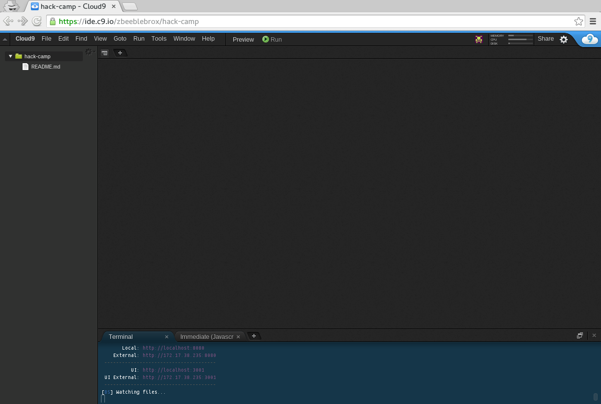
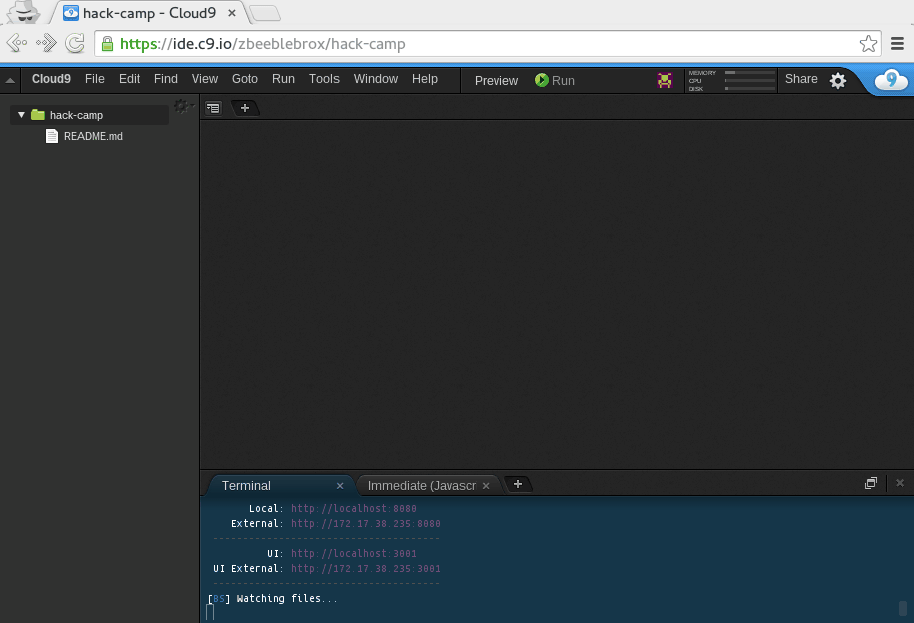

# Portfolio

## Cloud9

- Go to https://github.com/join and sign up for a free account
- Go to https://c9.io, click the `Sign Up` button, and click `GitHub`
- Click `Go to your dashboard`
- Creating a workspace
  - Click `Create a new workspace > clone from URL`
  - Fill in the source url with
    `https://github.com/MaxWofford/hack-camp-workspace`
  - Click `Create workspace`
- Wait while your workspace is created (the workspace name will show up greyed
  out when it is loading)
- Select your `hack-camp` workspace and click `START EDITING`
- Configuring your workspace
  - Select the `Minimal Editor` preset.
  - Go ahead and close the welcome tab

    

  - At the very top of the window, click the little triangle on the bar to show
    the Cloud9 editor options.

    

  - Click `View` and then `Console`
  - Your workspace should now look like the following:

    

  - Final step, paste the following command into the console on the bottom and
    hit enter. This may take a few minutes to finish.

  ```sh
    $ sh .setup.sh
  ```
  - When it's done, your workspace should look like the following:

    

## Portfolio website

  - On the left file pane, right click and click `New Folder` to create a new
    folder. Name it `portfolio`

    

  - Create a new file inside of portfolio called `index.html` and open it

    

  - Go ahead and type the following into the open file (don't copy and paste it!
    and make sure to indent properly!). Replace "Zaphod Beeblebrox" with your
    first and last name.

    ```html
    <!DOCTYPE html>
    <html>
      <h1>Zaphod Beeblebrox</h1>
    </html>
    ```

  - Let's see what our website looks like so far.

    

  - We can also open the website in its own tab.

    

## Putting it on GitHub

  - In the terminal, type in `git init`
  - Go to `github.com/new` and create a new repository called 'portfolio-website'
  - Copy the URL of the github page, and type in your terminal `git remote add
    origin https://github.com/ZaphodB/portfolio-website`, where the URL is your
    repository URL
  - Put your code on GitHub by typing:
    - `git add index.html`
    - `git commit -m "add index.html"`
    - `git push origin master`