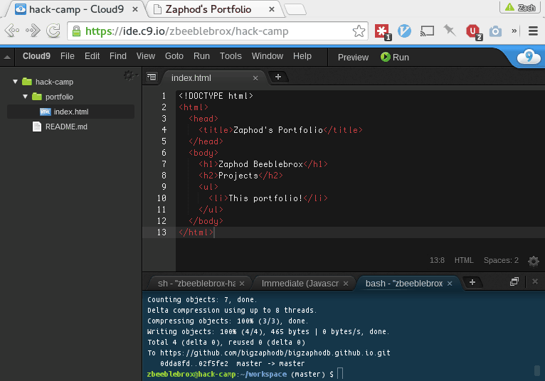
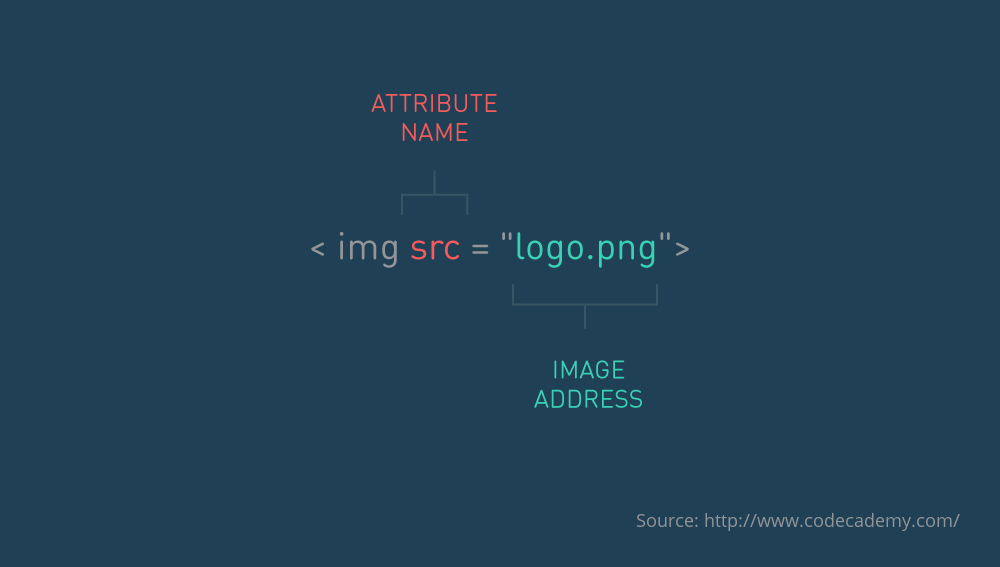
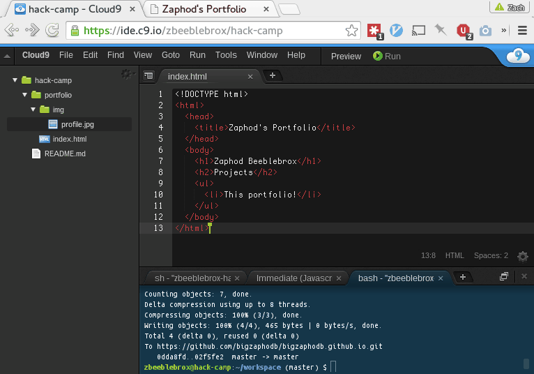

  - Now let's add a picture of ourselves to the site. Create a directory
    called `img` in our portfolio directory and upload a picture of yourself
    (or something else, if you'd rather not share a picture of yourself
    online).

    

  - Time to add the image we uploaded to our site. We can use the `img` tag to
    do this. The `img` tag has an attribute inside of it called `src` that we
    can use to specify the location of the image. Unlike most tags in HTML, we
    don't need a closing tag for the `img` tag.

    

    Let's go ahead and add an image tag above our "Projects" heading for our
    profile picture. Replace `profile.jpg` with the name of the file you
    uploaded.

    ```html
    
    ```

    

  - Let's take a snapshot of our changes with git and upload it to GitHub. Run
    the following commands.
  - `git add --all` - tell git to add all of our changes to the current
    snapshot
  - `git commit -m "Add profile picture."` - tell git to create a snapshot
    with the message "Add profile picture."
  - `git push` - upload our changes to GitHub

    

  - Let's take a snapshot of our changes with git and upload it to GitHub. Run
    the following commands.
  - `git add --all` - tell git to add all of our changes to the current
    snapshot
  - `git commit -m "Add profile picture."` - tell git to create a snapshot
    with the message "Add profile picture."
  - `git push` - upload our changes to GitHub

    

--------------------------------------------------------------------------------

[Adding a profile picture](add_profile_pic.md)