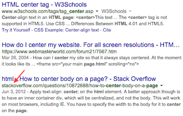
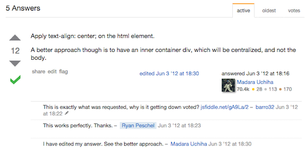

# Solution: Centering Solution

## Googling the solution

```
Pro-tip!

{o,o}
./)_)
  " "

Stack overflow is a great Q&A resource that almost every programmer I (Jonathan) knows uses. Whenever I see a Stack Overflow result in my Google search, there is a high likelyhood I may open that result first. Here is one helpful way I've found to understand Q&A type sites like Stack Overflow

```

- I google `center page html`

    > 

- I see that the 3rd result is a Stack Overflow page, which is a great resource.

- I open the first result [`"html - How to center body on a page? - Stack Overflow"`](http://stackoverflow.com/questions/10872688/how-to-center-body-on-a-page)

- The first thing I do is skip to the answers section. Once in the answers section, I look for the answer with the most upvotes and / or has the green checkmark (the answer selected to be the best by the person who asked the question is marked in green).
- In this case, the best answer was:

    > 

- it has the most upvotes (12)
- and has the asker's choice
- and the comments say `"This is exactly what was requested"` and `"This works perfectly. Thanks!"`
- And so I try to understand what it means: "Apply text-align: center; on the html element."
    - `"text-align: center;"` looks like an CSS property / value, what do I apply it to?
    - `"on the html element"`
- So it seems like I add this:

    ```css
    html {
      text-align: center;
    }
    ```

## Adding this snippet to my CSS

```css
img {
  width: 200px;
  border-radius: 50%;
}

html {
  text-align: center;
}
```

## Seeing the result

- I make sure that I have clicked on `Preview Running Application`
- I refresh the preview page to see:

> 


## Next

I'm just going to go over the remainder of the changes without doing challenges. I challenge you to try to figure out how to do it before copying over the changes yourself.

[Remainder of the CSS](css_rest.md)