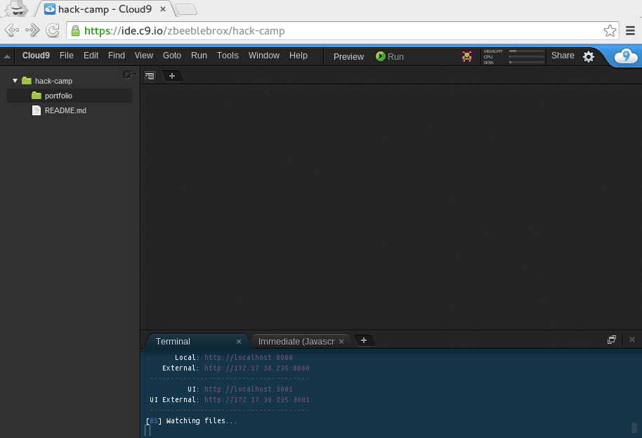
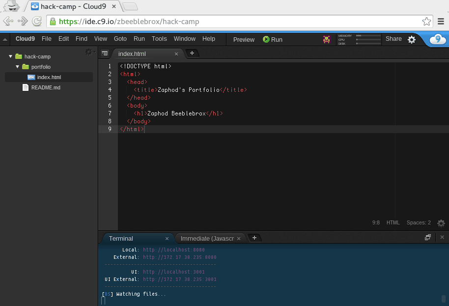

# Creating your project files

## Creating the project folder

For each project that we work on, we want to create a new folder for it.

We are creating a new portfolio website so lets make a new folder for our project named `portfolio`

- On the left file pane, right click and click `New Folder` to create a new
folder.
- Name it `portfolio`.


## Creating our `index.html`

- right click on the `portfolio` folder
- click `New File`
- name it `index.html`
- double click it to open it



## Pro-Tip for the remainder of this tutorial

```md
Pro-tip!

{o,o}
./)_)
  " "

WHEN TRYING TO LEARN SOMETHING NEW, DON'T COPY AND PASTE CODE OR ELSE
YOU WON'T REMEMBER IT AS WELL : )

Also, make sure you keep the same indentation that we do.
```

## Laying down the scaffold of every html page:

Type the following code into the open file.

Replace Zaphod's name with your own name.

```html
<!DOCTYPE html>
<html>
  <head>
    <title>Zaphod's Portfolio</title>
  </head>
  <body>
    <h1>Zaphod Beeblebrox</h1>
  </body>
</html>
```


## TODO: Explain the structure of the HTML document

## Previewing our work

Great! Now let's see what our code looks like in the browser.



## We can also open the website in its own tab.


## Next

Before moving forward further, let's [outline what code we need to write!](outlining.md)