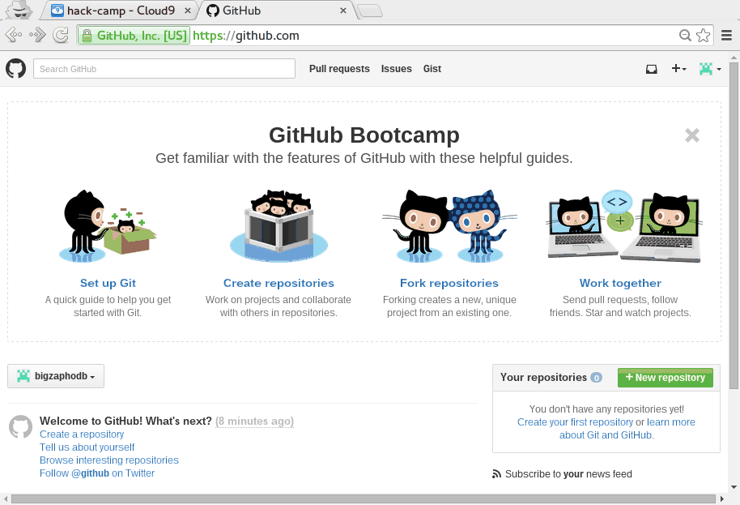

# Let's get this website on the real internet.

## About
[GitHub](https://github.com/) is where millions of developers store their code
online.

One of their services, [GitHub Pages](https://pages.github.com/), will put a
website online for you. We'll be using GitHub pages to "host" our portfolio.

## Creating a new "Repository"

Go GitHub homepage at https://github.com and create a new repository
- Make sure the repository name is _username_.github.io (replacing _username_
  with your GitHub username).
- Make sure `Initialize this repository with a README` **is NOT** checked.



## Git

To use GitHub, we need to use another tool called git. Git is a tool that lets
us take "snapshots" of the code we've written so far.

GitHub is a place where we can store our git projects and collaborate with
others. Do note, GitHub and git are _not_ the same thing. We'll go further into
the distinction later.

Git is already installed on Cloud9. 

## Initializing our Git repository

Go ahead and open a new terminal tab and run the command 

```bash
git init
```

to create  a new git project.


## Adding our files

Go ahead and run 
```bash
git add -A :/
```

and then 

```bash
git commit -m "Initial commit."
```

in the terminal.

Don't worry about what these two commands mean, they're just telling git to
create a snapshot of our code and adding the message `"Initial commit."`` to the
snapshot.


## Connecting Git to Github

Final step. 

Let's tell git to upload our code to GitHub. Run the following two commands in
your terminal, replacing `username` with your GitHub username.

It'll prompt you for your GitHub username and password, go ahead and enter
those. Don't worry if it doesn't display any characters while you type your
password, just hit enter when you're done.

```bash
$ git remote add origin https://github.com/username/username.github.io
$ git push -u origin master
```


Great! Now if you head over to
`https://{username}.github.io/portfolio/index.html` (replace `{username}` with
your GitHub username), you'll see the site we just made deployed live.

It may take a few minutes for GitHub to prepare your site. If you get an error,
no worries, just wait a few minutes and try again!

## Celebrate!

Your website is now on the live interet! Anyone you give this link to will be
able to see it!


## Next

Our website looks pretty plain right now so let's
[add some styles with CSS](add_css.md)!
