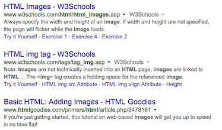
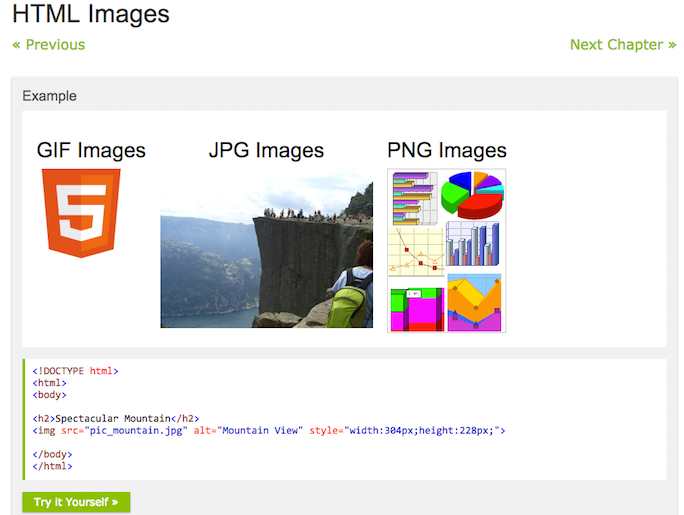

# Image Challenge Solution

To recap: we want to add the image so that it appears at the top of your page.

I don't know how to add an image to my HTML page so I'll google it

## How I found the answer using Google

I googled `html image`

> 

I opened the [first result titled "HTML Images - W3Schools"](http://www.w3schools.com/html/html_images.asp)

> 

I try [the example](http://www.w3schools.com/html/tryit.asp?filename=tryhtml_images_mountain)

> 

I know that the `h2` tag is responsible for making the text "Spectacular Mountain" big and bold. So threfore it seems like the `img` tag was responsible for adding the image to the page:

> ```html
> `
>```

I'm still not convinced I understand how this works, let me keep reading the W3Schools page... I scroll to find this:

> 

Ok, so it seems like these `img` tags

- don't have a closing tag
- require this `src="url"` thing where I put my URL for the image
- I also note that this `img` tag doesn't have a `style="..."` so it seems like those are optional
- and they mention something about `alt="some text"` but I'm not sure what that is...
  - I'll ignore it for now...
  - (*if you keep reading further, it explains the `alt="some text"` in the next section*).
)

```
Pro-tip!

{o,o}
./)_)
  " "

DO NOT USE the `style="..."` anywhere in your HTML
This makes your code really messy.

Any styling that you do should be in your CSS (which we will discuss later).

If you want to learn more, google `inline style bad`.

This was why we gave the warning about why you have to be careful when using W3Schools.
```

Ok so let me try to make my own `img` tag.

Note I replaced `alt="some_text"` with `alt="Description of Image"` because I noticed that in the "Spectacular Mount" example, they put a description of the photo, `alt="Mountain View"`.

```html
`
```

## Making My Own Image

So when I fill in the `img` tag template I made above, I get this:

```html
`
```

## Adding the image to my code

```html
<!DOCTYPE html>
<html>
  <head>
    <title>Zaphod's Portfolio</title>
  </head>
  <body>
  <!-- PORTFOLIO -->
  
    <!-- IMAGE SECTION -->
      <!--==================BEGIN_CHANGES==================-->
      
      <!--===================END_CHANGES===================-->
  
    <!-- INFORMATION SECTION -->
      <h1>Jonathan Leung</h1>
      <p>I want show people that the world is malleable. I want them to know 
      they can create what's missing and not be afraid to break the status quo.</p>

    <!-- SOCIAL MEDIA SECTION -->
      - link to Facebook (https://facebook.com/jonleung137)
      - link to Twitter (https://twitter.com/jonathanjleung)
      - link to Github (https://github.com/jonleung)

  </body>
</html>
```

## Seeing the result

- I make sure that I have clicked on `Preview Running Application`
- I refresh the preview page to see:

> 


## Some Vocabulary

```html

 ^ "img" is the tag name
```

```html


note that  does not have a closing tag
```


```html

     ^^^^^^^^^^^^^^^^^^^^^^^^^^^^^^^^^^^^ this is an attribute
                                          of the image tag

     (think of attributes like settings)
```

```html

     ^^^ "src" is the name of the attribute
```

```html

          ^^^^^^^^^^^^^^^^^^^^^^^^^^^^^^ 
          "http://i.imgur.com/vS0HhER.jpg" is the value
          of the "src" attribute
```

```html

this ^^^^^^^^^^^^^^^^^^^^^^^^^^^^^^^^^^^^

sets the "source" of the image to be the above url
```

```html

   "alt" is the name of another attribute ^^^ 
```

```html

                                              ^^^^^^^^^^^^^^^^^^^^ 
                                          "Jonathan's Picture" is the 
                                          value of the "alt" attribute.
```

```html

                                          ^^^^^^^^^^^^^^^^^^^^^^^^^
                                          this is another attribute
                                          of the image tag

You can google more on what alt does by googling `img alt`
```

## Next
We've added EVERYTHING that we need in the HTML for Part 1. Let's take your website and put it on the internet!

[Put our code permanently on the live internet!](github.md)